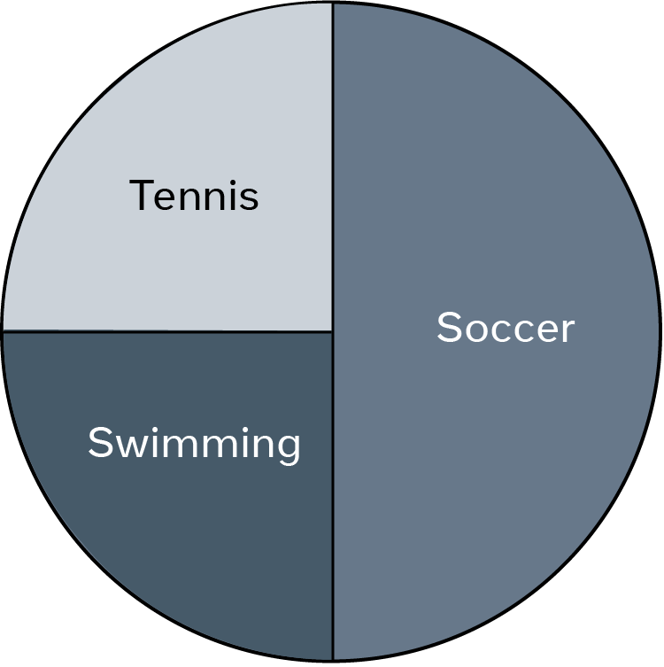

# Relational data example charts
Data gets collected and stored in databases from various sources and for a variety of reasons. For example, customer orders, student course enrollments and the use of user interaction and feedback to personalize content and improve services. 

It’s important to organize data, process it and present it efficiently to make it more useful and meaningful to people. The way data is related and presented enables people to form a better understanding of existing data. This understanding can be aided by relevant charts that present data visually using combinations of text, symbols and graphic elements to illustrate the relationship between data in a meaningful way.

Charts can convey a great deal of information and can capture people’s attention in a way that helps them to make better decisions and take suitable actions.  Here you will learn about basic charts that are commonly used to relate data together and to present it in a simple visual way.

### Bar chart
A bar chart is a graph that presents categorical data with rectangular bars, where the heights of the bars are proportional to the values that they represent. 

For example, the owner of a bookshop in London has had many challenges during the COVID-19 lockdown and wants to know more about their business performance and progress each year from 2019. A bar chart could be very useful in this case to show how sales revenue has changed over the past few years and how the pandemic impacted the business during lockdown.

This chart uses bars to present the bookshop’s sales data between 2019 and 2022. The x-axis presents the individual years, while the y-axis presents the value of sales. The bars illustrate the sales achieved each year. The taller the bar, the greater the value of sales. In this case, the tallest bar is in 2018, which indicates that this was the most successful year for the business. The smallest bar is in 2022, which indicates that this was the worst year for sales.

### Bubble chart
A Bubble chart is another popular type of data chart. It shows how different values compare to each other in terms of bubble size. The smaller bubbles represent smaller values, and the larger bubbles represent larger values. 

Let's examine the bubble chart below, which presents information about the 10 largest countries in the world in terms of population in 2015.  

In this example, a country's population value determines the size of each country’s bubble. 

There are large bubbles for China (around 1.4 billion people) and India (about 1.3 billion people), as these countries have the largest populations. Then there are medium size bubbles for the USA (about 330 million people) and Indonesia (about 270 million people). While Russia (about 145 million people) and Egypt (around 100 million people) have smaller-sized bubbles, as they have smaller comparable populations. 

These bubbles give you a good idea of the difference between the countries in terms of population sizes. The bubbles also help people to remember this kind of information, as human memory prefers graphical representation of data. After all, "a picture is worth a thousand words". 

### Line chart
A line chart presents information as a series of data points called “markers” connected by straight line segments. Line charts are extremely popular and are widely used in most data analytics fields.

The chart below depicts a company's gold price over the past month. There is a line that starts with the 10th of April, when the price of gold stood at $62,650 for 1kg. This line connects the dots that visualize the change in the gold price over time. The up and down movement of the line helps highlight positive and negative changes. 

This kind of chart is commonly used by data analysts to predict the future of the market based on overall trends. 

### Pie Chart
A pie chart is another type of data chart that displays how various data make up a whole of 100 percent. In this type of chart, each data point is allocated a "slice" of the pie according to its value. 

The following “Sports pie chart” depicts the type of sport preferred by students in a class.

If you ask someone looking at this chart about the percentage of students who like soccer, their answer will be 50%, as it is the slice's size that helps them to identify the percentage. In this case, “Soccer” occupies half of the pie and, therefore, it is 50% of the whole. Whereas “Tennis” and “Swimming” represent the other half of the whole pie. Since they are equals, each of them is a quarter of the pie, which is 25% of the whole. 

In addition to the charts introduced earlier in this reading, there are other types of charts that could be used for different purposes. An example is the area chart that combines the line chart and the bar chart to compare two or more quantities of data. Other commonly used charts include:

- dual axis charts,  

- Gantt charts,  

- heat maps  

- and scatter plot charts. 

What chart do I choose to present my data?  
Some charts can serve multiple purposes, whereas others are much better at conveying specific types of information to the audience. Line charts, for example, are best used to identify trends that help predict the future. Pie charts are a simple way to show how various parts create a whole. They are also quite easy to build. However, it’s difficult to add a percentage to each slide if there are many slices or if the slices are not exactly a half, or a quarter or a third of the whole. 

The answer to the question depends on several factors including:

- the target audience who will use the information,  

- the idea you intend to present,

- and the goal you want to achieve.  

Your choice of chart will be determined by the message you want to deliver to your audience, the type and amount of data you want to load to the graph and so on. 

Once you have identified the audience and assessed the data, you can experiment with different charts to find the best option. If there are multiple charts that are suitable to present your data, choose the one that engages your audience and boosts their interest in the information.

By considering all these factors, you should be able to identify the most appropriate chart that serves your purpose.
