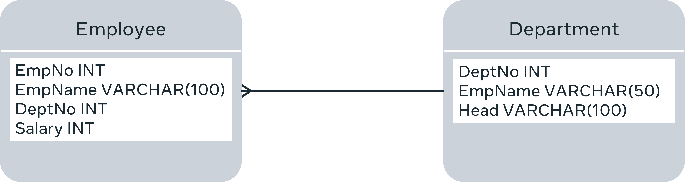

# Exploring database schema
In this reading, you’ll explore the concept of a database schema in more detail. You have already been exposed to the concept of a database schema and you have explored a simple example of what a database schema looks like. The main objective of this reading is to explain the concept of database schema in more detail by focusing on the three main types of database schema. Database schema is an important concept to understand in terms of relational databases.

### What is a database schema?
Designing the schema or structure of a database is the very first step in designing a database system. Database schema is about the structure of a database. In other words, how data is organized in a database. Data in a database is organized into tables that have columns and rows. Each column or field has a defined data type, and the tables are related to each other. The simplest way of understanding database schema is to think of it as the blueprint of a database. Before anyone can use a database to store and manipulate data, the database schema must first be designed. This process of database schema design is also known as data modeling.

Usually, the database schema is designed by database designers. The database schema is just the skeleton of the database, and it doesn’t store any actual data. Once the designers have provided the database schema, the developers can understand how the data should be stored by the application that they are implementing.

Database schema can be broadly divided into three categories. 

  1. Conceptual or logical schema that defines entities, attributes and relationships. 

  2. Internal or physical schema that defines how data is stored in a secondary storage. In other words, the actual storage of data and access paths. 

  3. External or view schema that defines different user views. 

### Conceptual or logical schema
The conceptual or logical schema describes the structure of the entire database for all the users. It describes the structure in terms of entities and features of the entities and the relationships between them. An Entity Relationship Diagram (ER-D) is usually drawn to represent the logical schema of a database. At this level, details about the physical storage and retrieval of data are hidden, and the database structure is described only at a concept level. The software developers work with the database at this level.

Here’s an example of a logical schema.

