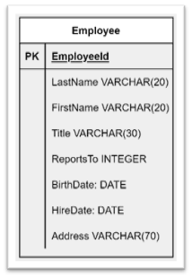
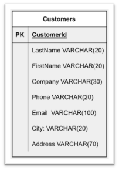
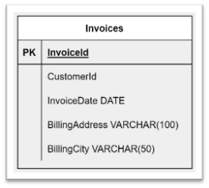
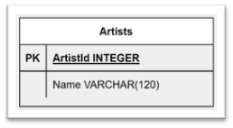
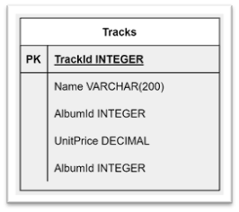
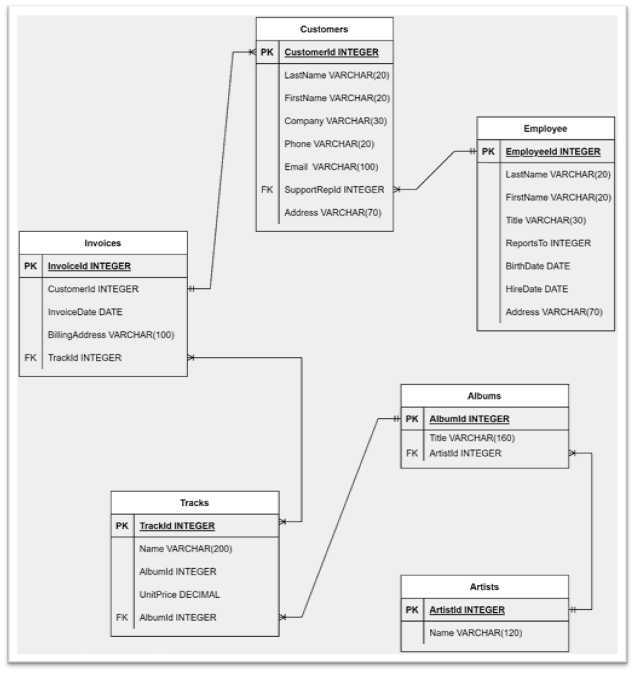
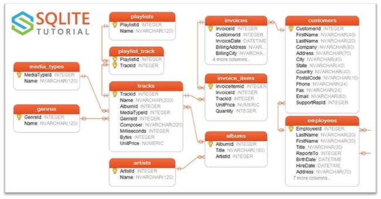

# C1M4L3 – (Exercise: Database schema Examples)

  
 ### **Tips: Before you Begin**
> - To view this file in Preview mode, right click on this LabInstructions.md file and `Open Preview`

 
 

This lab covers an example of a database schema to demonstrate how data can be organized and related in tables. This example will help you to understand how to design a database schema.

#### The chinook database example
In this exercise, you’ll work with the well-known “chinook sample” database, which is widely used for example relational database demos and testing purposes. It has also been implemented on the Coursera platform, which means it’s a good idea to familiarize yourself with it. However, this exercise doesn’t include the entire chinook schema. It only focuses on some of the main tables introduced in the database to highlight how a database schema is designed.

#### Database schema design
Before you develop your database, you should design a relevant database schema to document the requirements and to propose an architecture for the database structure. To design a basic database schema, you need to apply the following steps:
 
Step 1: Define the database purpose. 

Step 2: Identify the database tables including:
* Table attributes
* Attribute data types
* Primary key for each table 

Step 3: Create relationships between tables.

Instructions
Please attempt the following tasks before you continue so you can check and compare your answers with the solution.

Task 1: Identify the database’s purpose. 

Task 2: Identify 6 main tables with a brief description and a primary key for each table. 

Task 3: Identify the relationships between the 6 main tables.

Task 4: Create an entity relationship diagram of the 6 main tables.

#### Task 1: Identify the database purpose
The “chinook sample” database represents a fictitious digital media company that includes information about artists, albums, media tracks, invoices and customers.

#### Task 2: Identify the database tables
The chinook sample database has adequate normalization levels and 11 tables to store and relate data to avoid data redundancy. However, this exercise only focuses on 6 main tables including some relevant attributes for each.

Table name: Employees

Description:  The employee table stores the data of all employees. 

Diagram: The diagram presents 8 attributes with relevant datatypes. Employee ID is the primary key in this table.	 

 
Table name: Customers

Description: The customer table stores customers data. 

Diagram: In the diagram, 8 attributes with relevant datatypes are presented. Customer ID is the primary key in this table.	 

Table name: Invoices

Description: The invoice table stores data on invoices. 

Diagram: In the diagram, 5 attributes with relevant datatypes are presented. Invoice ID is the primary key in this table.	 

 

Table name: Artists

Description: The artist table stores data on artists. 

Diagram: Only 2 attributes, the artist ID and artist name, are presented in the diagram alongside their relevant data types. Artists ID is the primary key in this table.

 

Table name: Albums	

Description: The album table stores data about a list of tracks. 

Diagram: In the diagram, 3 attributes with relevant data types are presented. Album ID is the primary key in this table.

Table name: Tracks

Description: The tracks table stores the data of songs. 

Diagram: In the diagram there are 5 attributes with relevant data types. Tracks ID is the primary key in this table.	 

Task 3: Identify relationships between tables

The chinook sample database defines the following relationships between the 6 stated tables. 

●	Each employee supports one or many customers.

●	Each customer may have multiple invoices.

●	Each track belongs to one album.

●	Each invoice relates to one track.

●	Each track belongs to one album.

●	Each album may contain multiple tracks.

●	Each artist has one or more albums.

Task 4: Create an entity relationship diagram

The final diagram connects all tables by using the foreign keys as illustrated in the following diagram. Remember this is just a customized part of the chinook database schema. 

Additional task (optional)
You are required to extend the customized chinook schema by adding a new table called “location” that shows the city and the country that the artist lives in. 

Solution
*	Add a new table called location. 
*	Add a foreign key “locationId” to the “Artists” table to connect it with the location table.
*	The new chinook customized schema must be similar to the following ER-diagram.

